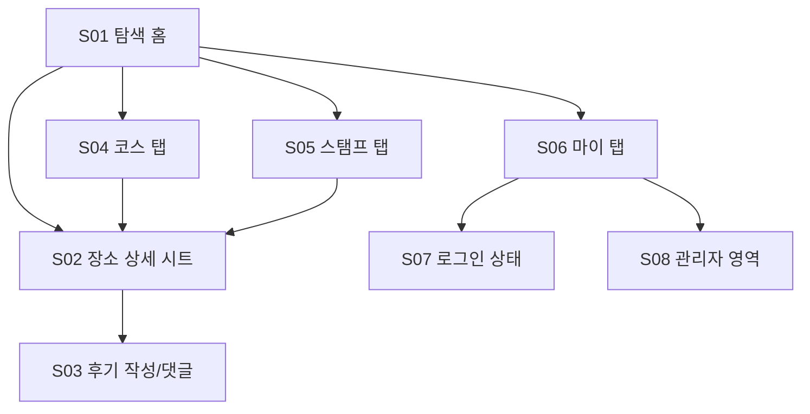

# JamIssue 화면설계서

기준일: 2026-03-15  
기준 저장소: `D:/Code305/JamIssue`

이 문서는 PRD의 의도와 실제 구현 사이를 잇는 화면 기준서다.  
목적은 세 가지다.

1. UI/UX 재현율을 높인다.
2. 후속 기능이나 페이지가 추가되어도 화면 언어가 흔들리지 않게 한다.
3. 구현자, 리뷰어, 디자이너가 같은 기준으로 검수할 수 있게 한다.

---

## 1. 문서 사용 원칙

- 이 문서는 모바일 우선 기준이다.
- 기준 기기는 `iPhone 12 ~ 17` 폭대의 세로 화면이다.
- 하나의 화면은 "한 번에 한 가지 핵심 행동"만 강하게 유도해야 한다.
- 화면을 추가하거나 수정할 때는 먼저 이 문서의 `전역 규칙`을 따른 뒤, 해당 `화면 명세`를 본다.
- 화면 구현이 설계서와 다를 경우, 구현이 아니라 설계서를 먼저 갱신한다.

---

## 2. 제품 UI/UX 방향성

### 2-1. 핵심 태도

- 대전 여행 정보를 "빵과 잼"처럼 가볍고 직관적으로 고르게 만든다.
- 텍스트를 읽게 하기보다, 터치로 고르게 만든다.
- 사용자가 길게 생각하지 않도록 `지도 -> 선택 -> 확인 -> 행동` 흐름을 유지한다.

### 2-2. 절대 지켜야 할 것

- 타겟: 20~30대 여성 중심
- 분위기: 파스텔, 귀여움, 가벼움, 과한 설명 금지
- 사용 방식: 단일 터치 중심, hover 의존 금지
- 정보 구조: 지도와 카드 중심
- 콘텐츠 톤: "정보 나열형 관광 사이트"처럼 보이지 않아야 함

### 2-3. 절대 하지 말아야 할 것

- 기술 스택이나 구현 정보를 사용자 화면에 노출하지 않는다.
- 헤더를 여러 겹 고정해서 화면 상단을 과도하게 점유하지 않는다.
- 제목을 부자연스럽게 두 글자씩 끊거나, 카드마다 줄바꿈 규칙이 달라지게 두지 않는다.
- 스탬프처럼 조건이 있는 행동을 항상 활성화된 버튼으로 보여주지 않는다.
- 한 탭의 상태 메시지가 다른 탭까지 끌려오게 두지 않는다.
- 스크롤이 길어질수록 정보가 더 좋아진다고 착각하지 않는다.

---

## 3. 전역 레이아웃 규칙

## 3-1. 기준 프레임

- 기준 폭: `390px`
- 허용 폭: `360px ~ 430px`
- 기본 패딩: 좌우 `16px`
- 카드 간 간격: `12px ~ 16px`
- 섹션 간 간격: `20px ~ 24px`
- 하단 탭 높이: 터치 영역 포함 `64px 이상`
- 주요 버튼 높이: `44px 이상`

## 3-2. 고정 영역 규칙

- 기본 고정 영역은 `하단 탭`만 둔다.
- 상단 헤더는 기본적으로 본문 스크롤 안에 포함한다.
- 상세 시트가 열릴 때만 시트 헤더를 따로 둘 수 있다.
- "상단 브랜딩", "상태 배너", "탭 헤더", "지도 고정"을 동시에 고정하지 않는다.

## 3-3. 타이포그래피 규칙

- 기본 폰트: `Pretendard`
- 제목: `20px`
- 본문/버튼: `12px`
- 캡션/배지: `8px`
- 한글 줄바꿈은 `keep-all` 성격을 우선한다.
- 버튼 라벨은 한 줄 유지가 기본이다.
- 제목은 2줄까지 허용, 3줄 이상이면 문구를 줄인다.

## 3-4. 색상 규칙

- 메인 액션: 벚꽃 핑크
- 보조 포인트: 채도 높은 하늘색
- 배경: 따뜻한 오프화이트 + 옅은 파스텔 그라데이션
- 경고/오류: 비비드 핑크 계열
- 다크모드 미지원

## 3-5. 상태 표현 규칙

- `로딩`: 스피너보다 짧은 문구와 카드형 플레이스홀더를 우선한다.
- `빈 상태`: "없음"보다 "첫 행동을 유도하는 문구"를 사용한다.
- `비활성`: 회색 처리만 하지 말고 비활성 이유를 함께 쓴다.
- `성공`: 화면 전체 토스트보다 해당 맥락 안의 짧은 안내를 우선한다.
- `오류`: 개발자 용어, 스택 메시지, 깨진 문자열 금지

---

## 4. 전역 상호작용 규칙

## 4-1. 내비게이션

- 1차 이동은 하단 탭 `탐색 / 코스 / 스탬프 / 마이`
- 2차 이동은 바텀시트 또는 카드 확장
- 3차 이동이 필요하면 별도 전용 화면으로 분리 검토

## 4-2. 시트와 레이어

- 탐색의 장소 상세는 바텀시트로 연다.
- 시트 깊이는 최대 2단계까지만 허용한다.
- 시트 위에 또 다른 전체 화면 모달을 얹지 않는다.

## 4-3. 조건형 CTA

- 조건이 있는 버튼은 기본 비활성으로 둔다.
- 활성 조건이 만족되면 강조 색으로 전환한다.
- 비활성일 때는 이유를 텍스트로 설명한다.

예시:

- 스탬프 버튼: 로그인 + 위치 확인 + 반경 충족 시에만 활성화
- 후기 작성 버튼: 로그인 + 작성 자격 충족 시에만 활성화

## 4-4. 데이터 동기화

- 선택한 장소, 스탬프 상태, 로그인 상태는 탭을 넘길 때 전역으로 섞이지 않게 한다.
- 상태 메시지는 탭 단위로 관리한다.
- 다른 화면의 성공/실패 메시지가 현재 화면의 핵심 정보보다 앞에 오지 않는다.

---

## 5. 화면 구조 개요

---

## 6. 화면 목록

| 화면 ID | 화면명 | 목적 | 주요 진입 경로 |
| --- | --- | --- | --- |
| S01 | 탐색 홈 | 대전 장소를 빠르게 고르게 함 | 앱 진입, 탭 이동 |
| S02 | 장소 상세 시트 | 선택한 장소의 핵심 정보를 확인하게 함 | 지도 마커, 코스, 스탬프, 후기 버튼 |
| S03 | 후기/댓글 영역 | 방문 감상 공유와 상호작용 | 장소 상세 시트 내부 |
| S04 | 코스 탭 | 기분별 추천 동선을 바로 선택하게 함 | 하단 탭 |
| S05 | 스탬프 탭 | 현장 방문 유도와 수집 보상 제공 | 하단 탭 |
| S06 | 마이 탭 | 내 계정, 내 후기, 내 스탬프 확인 | 하단 탭 |
| S07 | 로그인 상태 블록 | 로그인 전환과 계정 연결 | 마이 탭, 후기/스탬프 진입 |
| S08 | 관리자 영역 | 장소 노출 제어와 운영 확인 | 관리자 계정의 마이 탭 |

---

## 7. 화면 상세 명세

## 7-1. S01 탐색 홈

### 목적

- "지금 대전에서 어디를 갈지" 빠르게 고르게 한다.
- 지도 중심으로 장소를 고르고, 바로 상세 정보로 이어지게 한다.

### 필수 모듈

- 브랜드 헤더
- 오늘의 한 줄 카피
- 카테고리 필터 칩
- 대전 지도
- 선택 장소 프리뷰 카드
- 선택 장소 미니 후기 0~2개

### 레이아웃 순서

1. 브랜드 헤더
2. 짧은 서브카피
3. 카테고리 필터
4. 지도
5. 선택 장소 프리뷰 카드
6. 최근 후기 미리보기

### 행동 규칙

- 첫 진입 시 대표 장소 1개를 기본 선택 상태로 둔다.
- 지도 마커를 누르면 선택 장소 프리뷰 카드가 즉시 바뀐다.
- 프리뷰 카드의 주 CTA는 `장소 후기 열기` 또는 `자세히 보기` 중 하나만 둔다.
- 후기 미리보기는 2개까지만 보여준다.

### 금지 규칙

- 기술 스택 표기 금지
- 의미 없는 상태 배너 상시 노출 금지
- 제목을 3줄 이상 길게 두지 않기
- 선택 장소와 무관한 메시지가 상단에 남아 있지 않기

### 상태

- 로딩: 지도 영역 스켈레톤 + "대전 지도를 준비하는 중"
- 빈 상태: "준비된 장소가 아직 없어요"
- 오류: "장소를 불러오지 못했어요. 잠시 후 다시 볼게요."

## 7-2. S02 장소 상세 시트

### 목적

- 선택한 장소의 핵심 정보, 분위기, 후기, 스탬프 행동을 하나로 묶는다.

### 필수 모듈

- 장소명 / 구 / 예상 방문 시간
- 한 줄 요약
- 분위기 태그
- 방문 포인트 설명
- 스탬프 상태 블록
- 후기 리스트
- 댓글 스레드
- 후기 작성 CTA

### 행동 규칙

- 지도나 코스에서 선택한 장소를 같은 시트로 연다.
- 시트 상단에는 장소 정보, 하단에는 커뮤니티 정보를 둔다.
- 후기 작성은 항상 장소 컨텍스트 안에서 시작한다.
- 댓글은 후기 카드 내부에서 계층을 유지한다.

### 금지 규칙

- 상세 시트 안에서 또 다른 전체 화면 페이지를 억지로 열지 않기
- 장소와 무관한 글로벌 공지 섞지 않기
- 스탬프 상태와 후기 권한 조건을 분리해서 모호하게 보여주지 않기

## 7-3. S03 후기/댓글 영역

### 목적

- 방문 경험을 피드처럼 남기고, 공감 가능한 소통을 만든다.

### 필수 모듈

- 후기 카드
- 감정 태그
- 작성 시각
- 이미지 0~1장
- 댓글 / 대댓글
- 후기 작성 폼

### 후기 작성 규칙

- 기본 입력 항목: 감정 태그, 본문, 이미지 1장
- 검색형 입력 대신 선택형 입력을 우선한다.
- 추후 정책: `스탬프 적립 후 24시간 이내`일 때만 신규 후기 작성 허용

### 댓글 규칙

- 댓글은 최대 2단계까지만 허용
- 삭제된 댓글은 자리만 남기고 본문은 감춘다.

### 금지 규칙

- 장문의 자유서술을 강제하지 않기
- 입력 폼이 후기 리스트보다 먼저 시각 우선순위를 가져가지 않기

## 7-4. S04 코스 탭

### 목적

- 사용자가 "기분"만 고르면 바로 동선을 선택하게 한다.

### 필수 모듈

- 기분 필터 5종
- 코스 카드 리스트
- 카드 내 대표 장소 칩

### 레이아웃 규칙

- 필터 칩은 한 줄 5칸 균형을 우선한다.
- 카드 헤더는 `기분 라벨 / 코스 제목 / 소요시간` 구조를 유지한다.
- 코스 설명은 2줄 이내
- 장소 칩은 동일 높이와 동일 패딩 사용

### 행동 규칙

- 필터 선택 시 해당 무드 코스만 노출
- 코스 카드 선택 시 대표 장소를 탐색 홈과 연결하거나 상세 시트를 연다.
- 추후 `Directions 5` 연동 시 코스 상세 시트를 추가할 수 있다.

### 금지 규칙

- 필터 칩이 들쭉날쭉한 폭으로 어수선하게 배열되지 않기
- 코스 카드마다 시간 배지 위치가 달라지지 않기

## 7-5. S05 스탬프 탭

### 목적

- 현장 방문을 유도하고, 방문 완료를 보상으로 체감하게 한다.

### 필수 모듈

- 스탬프 진행률 요약
- 현재 위치 확인 상태 카드
- 장소별 스탬프 카드
- 거리 안내
- CTA 버튼

### 상태 규칙

- 기본: 비활성
- 위치 확인 중: 보조 문구 + 새로고침 버튼 비활성
- 반경 밖: 버튼 비활성 + 남은 거리 안내
- 반경 안: 버튼 활성
- 적립 완료: 완료 상태 고정

### 행동 규칙

- 위치를 확인하기 전에는 적립 CTA를 비활성으로 둔다.
- 반경 안에 들어오기 전에는 `찍기`가 아니라 `도착 필요` 상태를 보여준다.
- 이미 적립한 스탬프는 다시 해제하지 않는다.

### 금지 규칙

- 아무 때나 누를 수 있는 활성 버튼 금지
- 다른 탭에서 남은 상태 메시지를 이 탭 헤더처럼 보이게 두지 않기
- 장소 이름 줄바꿈이 카드마다 들쭉날쭉하게 깨지지 않기

## 7-6. S06 마이 탭

### 목적

- 내 계정 연결 상태와 개인 활동을 확인하게 한다.

### 로그인 전

- 로그인 혜택 요약
- 소셜 로그인 버튼
- 후기/스탬프가 왜 계정 연결이 필요한지 설명

### 로그인 후

- 닉네임 / 프로필
- 내 후기 수 / 내 스탬프 수
- 내 후기 리스트
- 모은 장소 리스트

### 행동 규칙

- 로그인 전과 후가 시각적으로 명확히 구분되어야 한다.
- 로그인 후에는 "로그인하라"는 CTA가 남아 있지 않는다.
- 내 후기/내 스탬프는 전체 데이터가 아니라 계정 기준 데이터만 보여준다.

## 7-7. S07 로그인 상태 블록

### 목적

- OAuth 로그인과 현재 세션 상태를 자연스럽게 연결한다.

### 규칙

- 로그인 버튼은 provider별 우선순위를 둘 수 있다.
- 네이버 로그인이 현재 기준 기본 제공자다.
- 로그인 성공 후에는 상태 안내보다 `내가 이제 할 수 있는 행동`이 먼저 보여야 한다.

### 금지 규칙

- 성공 후에도 로그인 CTA가 그대로 남아 있는 상태 금지
- `127.0.0.1` / `localhost` 차이로 상태가 꼬이지 않게 도메인 기준을 명확히 유지

## 7-8. S08 관리자 영역

### 목적

- 운영자가 장소 노출 여부와 데이터 상태를 빠르게 확인하게 한다.

### 현재 위치

- 관리자 계정의 마이 탭 하단

### 향후 권장

- 운영 기능이 늘어나면 별도 관리자 페이지로 분리

### 필수 모듈

- 전체 사용자 수
- 장소 수 / 후기 수 / 댓글 수 / 스탬프 수
- 장소 활성/비활성 토글
- 공공데이터 재가져오기

### 금지 규칙

- 일반 사용자에게 노출 금지
- 메인 UX보다 관리자 정보가 앞에 오지 않기

---

## 8. 공통 컴포넌트 규칙

## 8-1. 바텀 네비게이션

- 탭은 4개 고정: `탐색 / 코스 / 스탬프 / 마이`
- 라벨은 한 줄 유지
- 현재 탭은 배경 + 글자색 둘 다 바뀌어야 한다.

## 8-2. 칩

- 카테고리 칩, 무드 칩, 태그 칩의 높이는 계열별로 통일한다.
- 한 화면 안에서 칩 스타일 체계는 최대 2종까지만 허용한다.

## 8-3. 카드

- 정보 카드, 코스 카드, 후기 카드는 코너 라운드와 그림자 강도를 통일한다.
- 카드 안에는 제목, 본문, 태그, CTA 순서를 유지한다.

## 8-4. 지도

- 지도는 대전 범위 중심
- 마커는 카테고리나 잼 톤을 암시하는 색을 사용
- 지도를 장식으로 쓰지 않고, 선택 행동의 중심으로 둔다.

---

## 9. 후속 페이지 추가 원칙

## 9-1. 신규 페이지가 필요해지는 조건

- 하단 탭 안에서 3단계 이상 진입이 생길 때
- 한 화면에 서로 다른 핵심 행동이 2개 이상 충돌할 때
- 운영자 기능이 사용자 화면을 침범할 때

## 9-2. 우선 검토할 후보 페이지

- `P01 코스 상세 화면`
  - 길찾기 API 연동 후 실제 동선 지도 표시
- `P02 후기 작성 전용 화면`
  - 후기 정책이 복잡해질 경우
- `P03 알림/활동 내역`
  - 댓글, 스탬프, 공지 히스토리
- `P04 관리자 전용 대시보드`
  - 운영 기능 확장 시 분리
- `P05 권한 안내 화면`
  - 위치 권한, 알림 권한, 로그인 이점 설명

## 9-3. 신규 페이지 설계 체크

- 이 페이지의 핵심 행동이 한 문장으로 말해지는가
- 기존 탭 안에서 해결 가능한데 페이지를 늘리고 있지는 않은가
- 상단 고정 영역이 불필요하게 늘어나지 않는가
- 기존 카드/칩/시트 규칙을 재사용하고 있는가
- 로그인/위치/권한 조건을 비활성 상태와 함께 설명하는가

---

## 10. 구현 전 체크리스트

- [ ] 이 화면의 핵심 행동이 하나로 정리되어 있다.
- [ ] 사용자에게 기술 스택이 보이지 않는다.
- [ ] 제목 줄바꿈이 자연스럽다.
- [ ] 버튼 라벨이 1줄 유지된다.
- [ ] 상단 고정이 과하지 않다.
- [ ] 조건형 CTA는 기본 비활성 + 이유 안내를 따른다.
- [ ] 다른 화면의 상태 메시지가 섞여 들어오지 않는다.
- [ ] 모바일 390px 기준에서 카드와 칩의 정렬이 흔들리지 않는다.
- [ ] 로그인 전/후, 적립 전/후, 데이터 유무에 따른 상태가 분기되어 있다.

## 11. QA 검수 체크리스트

- [ ] 상단 제목이 부자연스럽게 두 글자 단위로 꺾이지 않는다.
- [ ] 탭 전환 시 이전 탭의 상태 문구가 남지 않는다.
- [ ] 관리자 UI가 일반 사용자에게 보이지 않는다.
- [ ] 로그인 성공 후에도 로그인 버튼이 잔상처럼 남지 않는다.
- [ ] 스탬프 버튼은 현장 반경 안에서만 활성화된다.
- [ ] 거리/상태/오류 메시지가 깨진 문자열 없이 노출된다.
- [ ] 코스 필터와 장소 칩의 높이, 간격, 정렬이 통일된다.
- [ ] 한 화면의 스크롤 길이가 불필요하게 길지 않다.
- [ ] 하단 탭이 콘텐츠를 가리지 않는다.

---

## 12. 이 문서와 함께 유지할 연계 문서

- PRD 대비 구현 상태: [docs/prd-compliance.md](D:/Code305/JamIssue/docs/prd-compliance.md)
- 백엔드 실행 및 구조: [backend/README.md](D:/Code305/JamIssue/backend/README.md)
- 데이터베이스 스키마: [backend/sql/schema.sql](D:/Code305/JamIssue/backend/sql/schema.sql)

---

## 13. 다음 반영 우선순위

1. 탐색 / 코스 / 스탬프 탭의 상단 구조를 이 설계서 기준으로 정리
2. 후기 작성 권한을 스탬프 적립 정책과 연결
3. 관리자 영역 분리 여부 결정
4. 코스 상세 화면 필요성 검토
5. 모바일 QA 결과를 이 문서 하단에 축적
